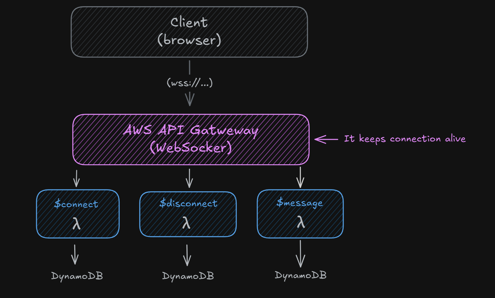

# 🛠️ Realtime AWS WebSocket Setup (Hono + Serverless + DynamoDB)

This guide will help you set up a realtime layer on AWS using:

- API Gateway WebSocket
- Lambdas with Serverless Framework
- Hono (HTTP + WebSocket microframework)
- DynamoDB to store `connectionId` by `room`
- ServiceFactory with classes (ConnectionService, RoomService)
- TypeScript 🧠

---

## Communication Flow



1. Client (Browser / App) → Opens a persistent WebSocket connection to your AWS endpoint.

2. API Gateway (WebSocket API) → Manages and keeps the WebSocket connection alive; it assigns a unique connectionId to each client.

3. $connect Lambda → Triggered when a client connects; usually stores the connectionId and related data (e.g., room info) in DynamoDB.

4. $disconnect Lambda → Triggered when a client disconnects; removes the connectionId from DynamoDB.

5. $message Lambda → Triggered when a client sends a message; processes the message, retrieves target connections from DynamoDB, and uses API Gateway Management to send messages back to other clients.

## 🧱 Initial Project Structure

```bash
my-app-realtime/
├── serverless.yml
├── tsconfig.json
├── package.json
├── src/
│   ├── handlers/
│   │   ├── connect.ts
│   │   ├── disconnect.ts
│   │   └── message.ts
│   │   └── message.router.ts
│   ├── lib/
│   │   ├── dynamo.ts
│   │   └── apigw.ts
│   ├── services/
│   │   ├── ConnectionService.ts
│   │   ├── RoomService.ts
│   │   └── ServiceFactory.ts
│   └── types/
│       └── RoomEvent.ts
│       └── Room.ts
```

---

## 🧪 Expected Environment Variables

Serverless will inject these automatically:

```env
AWS_REGION=
CONNECTIONS_TABLE=Connections
ROOMS_TABLE=Rooms
```

---

## 🚀 Deploy with Serverless

```bash
pnpm exec serverless deploy
```

The `serverless.yml` defines the WebSocket routes:

```yaml
functions:
  connect:
    handler: src/handlers/connect.handler
    events:
      - websocket:
          route: $connect

  disconnect:
    handler: src/handlers/disconnect.handler
    events:
      - websocket:
          route: $disconnect

  message:
    handler: src/handlers/message.handler
    events:
      - websocket:
          route: $default
```

---

## 🧪 Client Testing

You can use this snippet in your browser:

```ts
const socket = new WebSocket(
  "wss://<your-api-id>.execute-api.<region>.amazonaws.com/dev?roomId=test-room&slot=a"
);

socket.onopen = () => {
  console.log("✅ Connected");
  socket.send(JSON.stringify({ type: "ping", slot: "a" }));
};

socket.onmessage = (e) => console.log("📨", e.data);
```
